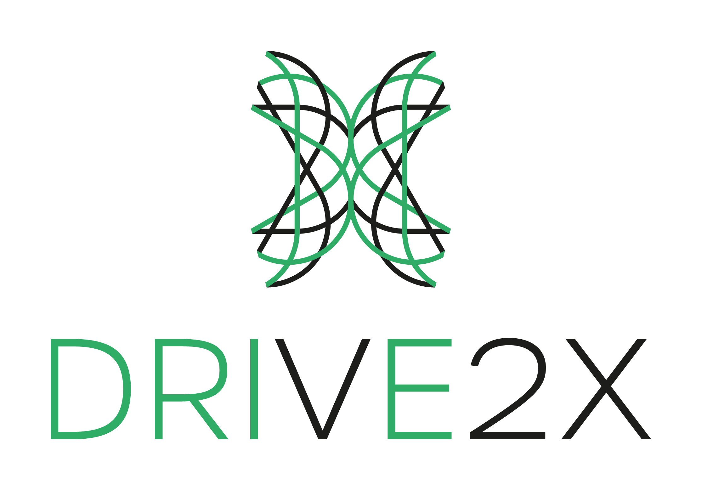
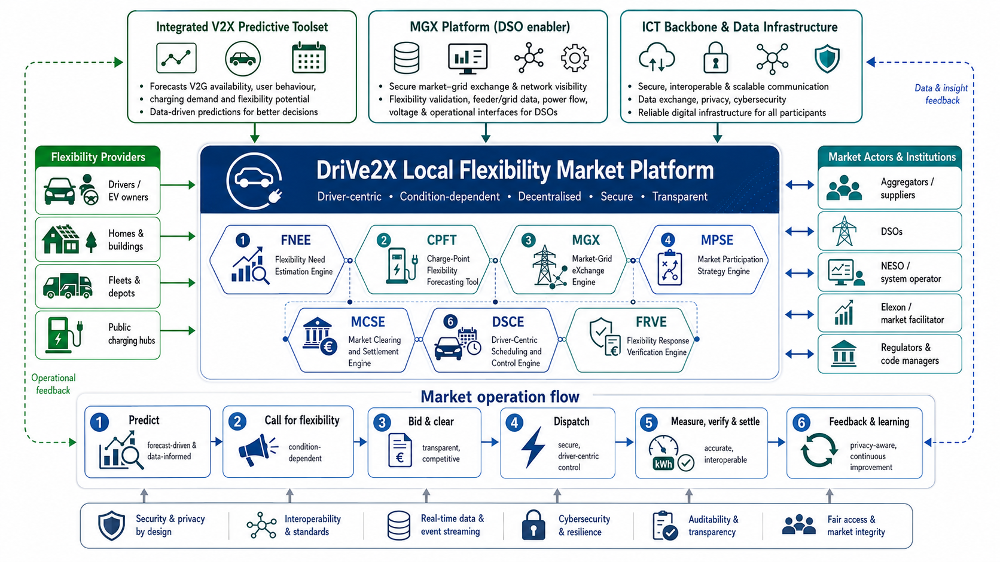
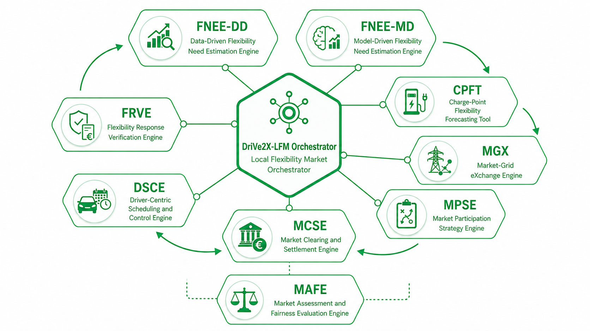

<!-- README visual palette: DriVe2X green #2FAF67, carbon black #161616, clean white #FFFFFF. -->

<p align="center">
  
</p>

<h1 align="center">DriVe2X Local Flexibility Market</h1>

<p align="center">
  <strong>Driver-centric, condition-dependent, decentralised, secure and transparent local flexibility market tools for V2X-enabled energy systems.</strong>
</p>

<p align="center">
  
  
  
  <a href="#licence"></a>
</p>

<p align="center">
  <a href="#purpose"></a>
  <a href="#software-architecture"></a>
  <a href="#platform-workflow"></a>
  <a href="#public-repositories"></a>
  <a href="#getting-started"></a>
</p>

---

## At a glance

| Focus | Driver-centric local flexibility markets for V2X-enabled EV assets |
|---|---|
| Platform chain | Need estimation -> flexibility forecasting -> bidding -> clearing -> dispatch -> verification |
| Engine family | FNEE-DD, FNEE-MD, CPFT, MGX, MPSE, MCSE, DSCE, FRVE, and MAFE |
| Design values | Security, interoperability, auditable exchange, transparent outcomes and driver trust |
| Lead organisation | [University of Salford](https://ces.salford.ac.uk/) |

---

## Purpose

The **DriVe2X Local Flexibility Market Platform**, **DriVe2X-LFM**, is a modular research software ecosystem for designing, testing and demonstrating **driver-centric local flexibility markets** using smart and bidirectional electric vehicle, EV, assets.

The platform supports the full local flexibility market chain, from identifying local network needs to preparing flexibility calls, estimating available V2X flexibility, supporting participant strategies, clearing market offers, dispatching driver-centric schedules, and verifying delivery for settlement.

In practical terms, the platform helps answer six operational questions:

1. **Where and when is flexibility needed?**
2. **How much flexibility should be requested?**
3. **Which EV, charging-site, fleet or aggregator resources may be available?**
4. **How should participants bid into the market?**
5. **Which offers should be cleared and dispatched?**
6. **Was the flexibility delivered, verified and settled fairly?**

The platform is being developed as part of the **DriVe2X project** and is aligned with the D3.4 deliverable, **Design of a Driver-Centric Local Flexibility Market**.

---

## Marketplace concept

The DriVe2X-LFM concept links flexibility providers, market actors, digital infrastructure and modular software engines into one driver-centric market workflow.

<!-- <p align="center">
  
</p> -->

The market operation flow follows:

```text
Predict → Call for flexibility → Bid and clear → Dispatch → Measure, verify and settle → Feedback and learning
```

This enables a Distribution System Operator, DSO, or market facilitator to move from a technical network need, such as congestion or voltage risk, to a structured market process that can activate consumer-led V2X flexibility while protecting driver mobility, privacy and trust.

---

## Software architecture

The LFM platform is organised to be operated via a **core orchestrator** and through a set of modular engines.

<p align="center">
  
</p>

The orchestrator coordinates the engines, validates data exchange, runs scenarios and produces platform-level outputs. Each engine remains independently testable, reusable and documented.

| Layer | Engine | Role |
|------|------|------|
| LFM Orchestrator | [**LFMO**](https://github.com/V2X-Local-Flexibility-Market/LFMO)     | Runs workflows, coordinates engines, validates data contracts and stores platform outputs. |
| Flexibility need estimation - Data-Driven| [**FNEE-DD**](https://github.com/V2X-Local-Flexibility-Market/fnee-dd)     | Data-driven flexibility need estimation using historical phase-flow data and LSTM forecasting. |
| Flexibility need estimation - Model-Driven | [**FNEE-MD**](https://github.com/V2X-Local-Flexibility-Market/fnee-md)     | Model-driven flexibility need estimation using network modelling and power-flow analysis. |
| Asset availability | [**CPFT**](https://github.com/V2X-Hub/CPFT)     | Charge-Point Flexibility Forecasting Tool, developed in another DriVe2X work package and called by the platform when needed. |
| Grid-market coupling | [**MGX**](https://github.com/V2X-Local-Flexibility-Market/MGX)     | Market-Grid eXchange Engine, developed in another DriVe2X work package and called by the platform when needed. |
| Market participation | [**MPSE**](https://github.com/V2X-Local-Flexibility-Market/mpse)     | Generates participant strategies, aggregator bids and offer curves. |
| Market operation | [**MCSE**](https://github.com/V2X-Local-Flexibility-Market/mcse)     | Clears offers, calculates awards, prices, unmet flexibility and preliminary settlement values. |
| Driver-centric dispatch | [**DSCE**](https://github.com/V2X-Local-Flexibility-Market/dsce)     | Converts market awards into feasible smart charging and discharging schedules. |
| Verification and settlement | [**FRVE**](https://github.com/V2X-Local-Flexibility-Market/frve)     | Verifies delivered flexibility, assesses performance and produces settlement evidence. |
| Fairness Evaluation | [**MAFE**](https://github.com/V2X-Local-Flexibility-Market/MAFE)     | Evaluates whether a cleared and verified LFM outcome is effective, fair, and inclusive. |


---

## Platform workflow

A typical day-ahead local flexibility workflow is:

```text
FNEE-DD or FNEE-MD
        ↓
flexibility_need_windows.csv
        ↓
CPFT, external work-package engine
        ↓
charge_point_flexibility_forecast.csv
        ↓
MGX, external work-package engine
        ↓
grid_market_requirements.json
        ↓
MPSE
        ↓
participant_bids.csv
        ↓
MCSE
        ↓
market_awards.csv
        ↓
DSCE
        ↓
dispatch_schedule.csv
        ↓
FRVE
        ↓
verification_settlement_report.csv
```

The orchestrator is designed to support both FNEE routes:

```yaml
fnee_route: data_driven   # use FNEE-DD
```

or:

```yaml
fnee_route: model_driven  # use FNEE-MD
```

Both routes produce the same platform-level output, `flexibility_need_windows.csv`, so downstream engines can consume a common flexibility-need contract.

---

## Public repositories

This GitHub organisation hosts the DriVe2X-LFM software ecosystem as separate repositories:

| Repository | Purpose |
|---|---|
| [`.github`](https://github.com/V2X-Local-Flexibility-Market/.github) | Organisation landing page, platform overview and documentation entry point. |
| [`fnee-dd`](https://github.com/V2X-Local-Flexibility-Market/fnee-dd) | Data-driven flexibility need estimation using LSTM forecasting and congestion-window identification. |
| [`fnee-md`](https://github.com/V2X-Local-Flexibility-Market/fnee-md) | Model-driven flexibility need estimation using network modelling and power-flow analysis. |
| [`MGX`](https://github.com/V2X-Local-Flexibility-Market/MGX) | Market-Grid eXchange Engine, developed in another DriVe2X work package and called by the platform when needed. |
| [`mpse`](https://github.com/V2X-Local-Flexibility-Market/mpse) | Market participation strategy, bid preparation and participant decision support. |
| [`mcse`](https://github.com/V2X-Local-Flexibility-Market/mcse) | Market clearing, award calculation and preliminary settlement logic. |
| [`dsce`](https://github.com/V2X-Local-Flexibility-Market/dsce) | Driver-centric scheduling and control for EV smart charging and V2X dispatch. |
| [`frve`](https://github.com/V2X-Local-Flexibility-Market/frve) | Flexibility response verification, performance assessment and settlement evidence. |
| [`lfmo`](https://github.com/V2X-Local-Flexibility-Market/LFMO) | Platform-level workflow orchestration, engine coordination and data-contract validation. |
| [`MAFE`](https://github.com/V2X-Local-Flexibility-Market/MAFE) | Evaluates whether a cleared and verified LFM outcome is effective, fair, and inclusive. |


The following tools are treated as **external work-package engines** and are called through adapters when needed:

```text
External callable engines
├── CPFT, Charge-Point Flexibility Forecasting Tool - Linked to Drive2X WP5
└── MGX, Market-Grid eXchange Engine - Linked to Drive2X WP8
```

This structure keeps ownership clear, avoids mixing independently developed work-package software, and supports future integration through documented data contracts, CLI calls, APIs or file-based adapters.

---

## Full documentation and contributing partners

The full documentation for the DriVe2X Local Flexibility Market platform and the contributing researchers and partners is provided at the link below:

- [Design of a Driver-Centric Local Flexibility Market:](Link to the final report will be Added after submission)

---

## Engine summary

### [FNEE-DD, Data-Driven Flexibility Need Estimation Engine](https://github.com/V2X-Local-Flexibility-Market/fnee-dd)

Forecasts next-day phase-level active-power flow in a distribution line and identifies expected or risk-adjusted congestion windows. It converts forecasted congestion into flexibility-call windows for downstream market processes.

**Main output:** `flexibility_need_windows.csv`

---

### [FNEE-MD, Model-Driven Flexibility Need Estimation Engine](https://github.com/V2X-Local-Flexibility-Market/fnee-md)

Uses a network model and power-flow analysis to identify congestion, voltage violations, feeder constraints and active-power flexibility needs. It is the model-driven complement to FNEE-DD.

**Main output:** `flexibility_need_windows.csv`

---

### [CPFT, Charge-Point Flexibility Forecasting Tool](https://github.com/V2X-Hub/CPFT)

Forecasts charge-point availability, charging demand and flexible capacity. CPFT is developed in another DriVe2X work package and should be connected to the orchestrator through an external adapter.

**Expected output:** `charge_point_flexibility_forecast.csv`

---

### [MGX, Market-Grid eXchange Engine](https://github.com/V2X-Local-Flexibility-Market/MGX)

Links grid constraints, operational requirements and market processes. MGX is developed in another DriVe2X work package and should be connected to the orchestrator through an external adapter.

**Expected output:** `grid_market_requirements.json`

---

### [MPSE, Market Participation Strategy Engine](https://github.com/V2X-Local-Flexibility-Market/mpse)

Converts flexibility opportunities, participant preferences, risk parameters and market conditions into participant strategies, bids and offer curves.

**Main output:** `participant_bids.csv`

---

### [MCSE, Market Clearing and Settlement Engine](https://github.com/V2X-Local-Flexibility-Market/mcse)

Clears the market under selected rules such as pay-as-bid or pay-as-clear. It calculates accepted offers, rejected offers, clearing prices, awarded volumes, unmet flexibility and preliminary payments.

**Main output:** `market_awards.csv`

---

### [DSCE, Driver-Centric Scheduling and Control Engine](https://github.com/V2X-Local-Flexibility-Market/dsce)

Transforms cleared market awards into feasible EV charging and discharging schedules while respecting driver constraints, state-of-charge requirements and mobility needs.

**Main output:** `dispatch_schedule.csv`

---

### [FRVE, Flexibility Response Verification Engine](https://github.com/V2X-Local-Flexibility-Market/frve)

Checks baseline, dispatch and measurement records to verify delivered flexibility, assess performance and produce settlement evidence.

**Main output:** `verification_settlement_report.csv`

---

## Deliverable report

The full technical background is provided in:

```text
D3.4, Design of a Driver-Centric Local Flexibility Market
```

When the deliverable is approved and publicly available, place the PDF here:

```text
docs/D3.4_Design_of_a_Driver_Centric_Local_Flexibility_Market.pdf
```

Then update this README with the official EU CORDIS link:

```text
https://cordis.europa.eu/project/id/101056934/results
```

### Suggested citation format

Please cite the deliverable and platform as follows, updating the final bibliographic details once the approved public version is available:

```text
Vahidinasab, V., Adelipour, S., et al. (2026). D3.4: Design of a Driver-Centric Local Flexibility Market. DriVe2X Project, Horizon Europe Grant Agreement No. 101056934, UKRI Reference No. 10055673.
```

For the software platform:

```text
Vahidinasab, V. (2026). DriVe2X Local Flexibility Market Platform: Modular software tools for driver-centric V2X flexibility market design, simulation and verification.
```

For individual engines, cite the relevant repository, for example:

```text
Vahidinasab, V. (2026). FNEE-DD: Data-Driven Flexibility Need Estimation Engine for the DriVe2X Local Flexibility Market Platform.
```

---

## Getting started

Each engine repository includes its own installation and execution instructions. A typical engine follows this pattern:

```bash
git clone https://github.com/V2X-Local-Flexibility-Market/<engine-repo>.git
cd <engine-repo>
python -m venv .venv
source .venv/bin/activate
pip install -e ".[test]"
pytest
```

On Windows PowerShell:

```powershell
git clone https://github.com/V2X-Local-Flexibility-Market/<engine-repo>.git
cd <engine-repo>
python -m venv .venv
.venv\Scripts\Activate.ps1
pip install -e ".[test]"
pytest
```

The orchestrator supports platform-level workflows such as:

```bash
python -m drive2x_orchestrator.cli \
  --workflow workflows/day_ahead_flexibility_call.yaml \
  --config configs/platform_config.yaml
```

The first orchestrator version should be tested using mock engines and mock CPFT/MGX adapters before connecting the real external work-package tools.

---

## Data contracts

The platform is built around explicit data contracts. These allow engines to remain independent while exchanging standardised outputs.

Key platform-level objects include:

| Data object | Producer | Consumer |
|---|---|---|
| `flexibility_need_windows.csv` | FNEE-DD or FNEE-MD | CPFT, MGX, MPSE, MCSE |
| `charge_point_flexibility_forecast.csv` | CPFT | MPSE, MCSE |
| `grid_market_requirements.json` | MGX | MPSE, MCSE |
| `participant_bids.csv` | MPSE | MCSE |
| `market_awards.csv` | MCSE | DSCE, FRVE |
| `dispatch_schedule.csv` | DSCE | FRVE |
| `verification_settlement_report.csv` | FRVE | Final platform output |

Each repository includes or should include a `docs/DATA_CONTRACT.md` file explaining its input and output requirements.

---

## Data, privacy and operational use

This organisation is intended for research software, reproducible examples and platform development. Public repositories should not contain:

- private operational network data,
- confidential partner data,
- personal data,
- unapproved DSO datasets,
- trained models based on restricted data,
- generated outputs from confidential scenarios.

Sample data should be clearly labelled as demonstration data.

Before using any engine for operational assessment, users should configure the relevant network assumptions, line limits, asset constraints, participant data, market rules and validation settings.

---

## Security, interoperability and trust principles

The DriVe2X-LFM platform is designed around the following principles:

- security and privacy by design,
- interoperability and standards,
- auditable data exchange,
- transparent market outcomes,
- fair access and market integrity,
- driver-centric flexibility activation,
- continuous feedback and learning.

---

## Licence

Unless stated otherwise, software repositories in this organisation are released under the **Apache License 2.0**.

Documentation, diagrams and non-code material may be reused under **CC BY 4.0** where explicitly stated.

Do not apply an open licence to confidential project material, partner-owned code, private operational data or draft deliverables that have not yet been cleared for public release.

---

## Contributing

Contributions, feedback and use cases are welcome.

Please use the relevant engine repository to:

- open issues,
- suggest improvements,
- report bugs,
- contribute tests,
- improve documentation,
- propose new scenarios or workflows.

Each repository should include a `CONTRIBUTING.md` file with engine-specific guidance.

---

## Contributors

This deliverable brings together a collaborative team of researchers, engineers and industry experts. Contributors to individual repositories and documents are acknowledged within the relevant repository or document.

---

## Project lead and contact person

[**Professor Vahid Vahidinasab**](https://github.com/vahidinasab)
Chair in Sustainability, University of Salford  
DriVe2X WP3 Lead and PI at the University of Salford   

---

## Acknowledgement

This work has been conducted as part of the [**DriVe2X project**](https://drive2x.eu/). The DriVe2X project has received funding from the European Union’s Horizon Europe research and innovation programme under Grant Agreement No. **101056934**. UKRI reference number: **10055673**. Views and opinions expressed in this software documentation are those of the author(s) only and do not necessarily reflect those of the European Union, CINEA, UKRI or the wider DriVe2X consortium. Neither the European Union nor the granting authority can be held responsible for them.
